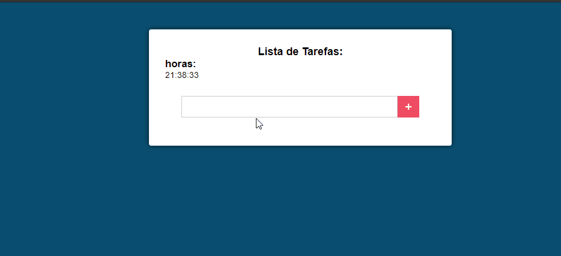

# Sobre

O Projeto foi desenvolvido em um curso, mas alterei e o layout e inseri mais algumas features para tentar melhorar.

### `Rodando o Projeto `

Basta apenas ter os instalar as dependências e usar npm start para desenvolver ou npm build para gerar uma build para fazer o deploy.

### `🚀 Tecnologias `

Esse Projeto foi desenvolvido usando:

✔️React JS

✔️Utilizei Class Components e seus ciclos de vida

✔️Utilizei Localstorage para salvar os dados da Tarefa
